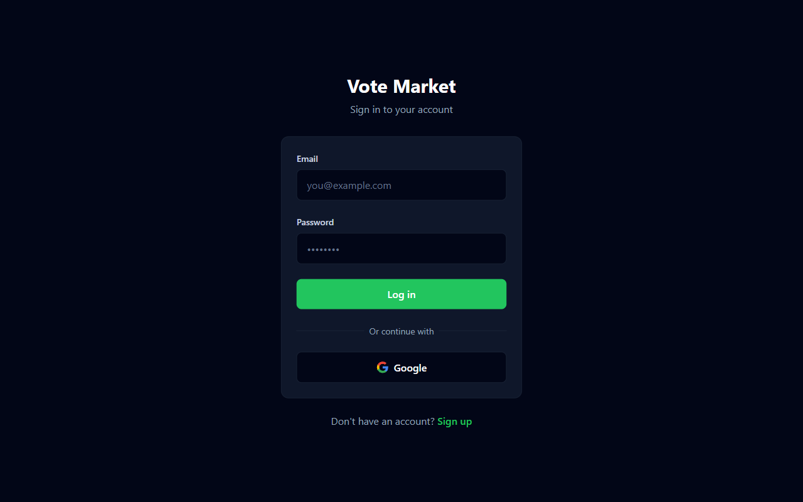
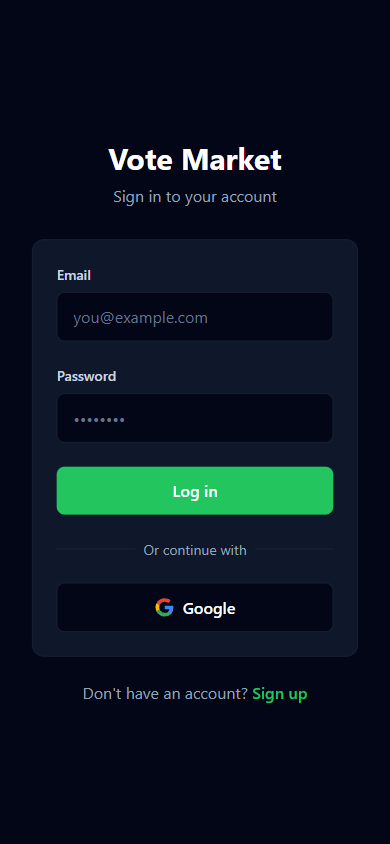
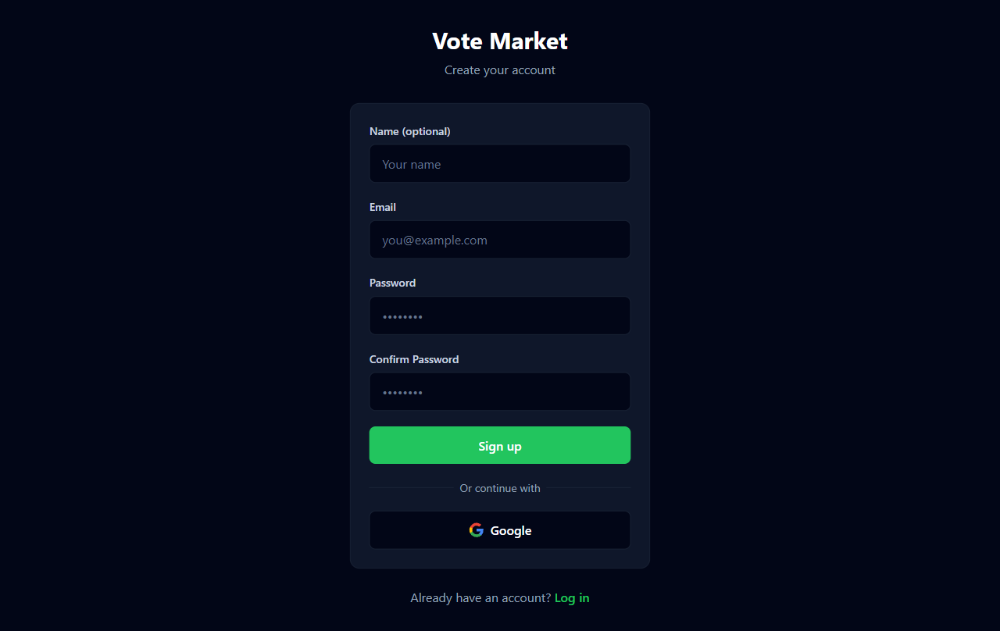
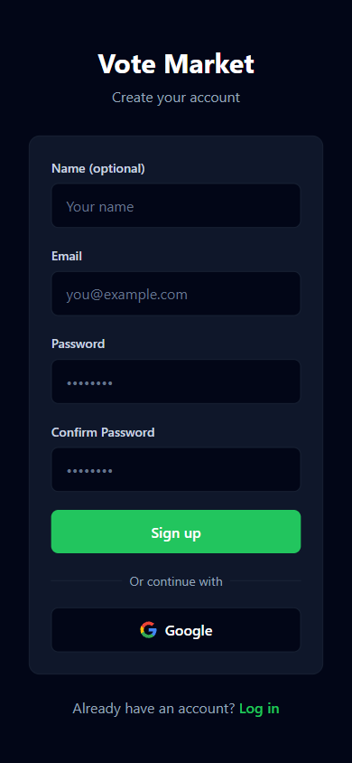
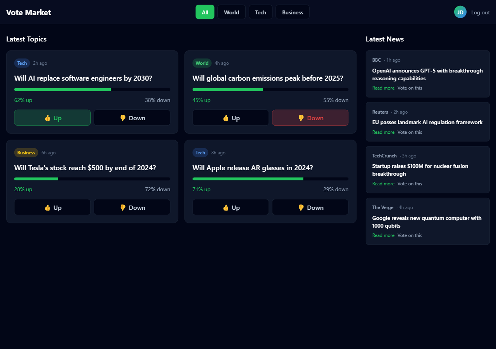
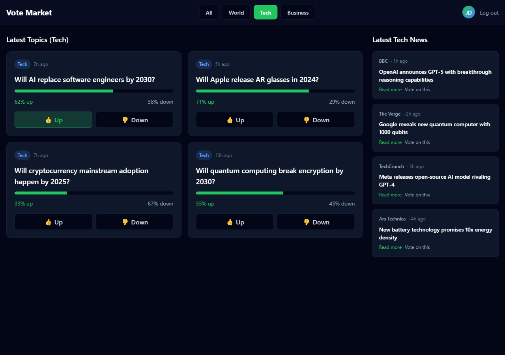
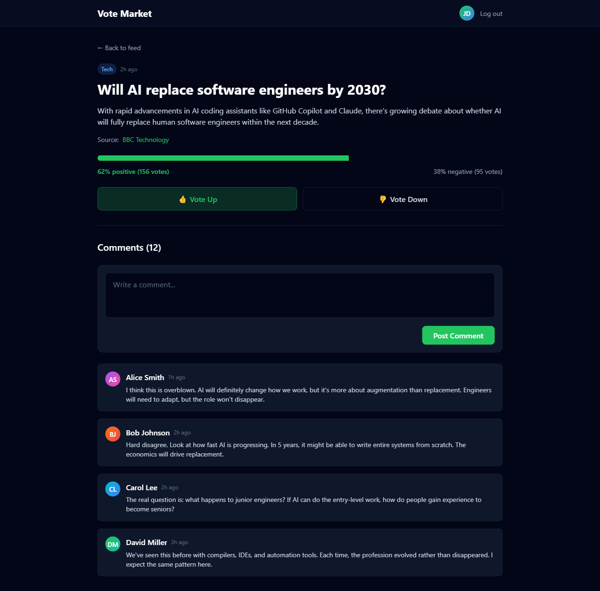
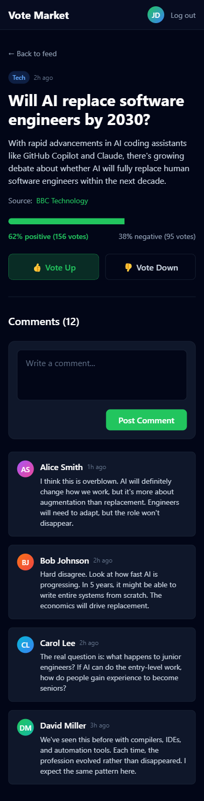
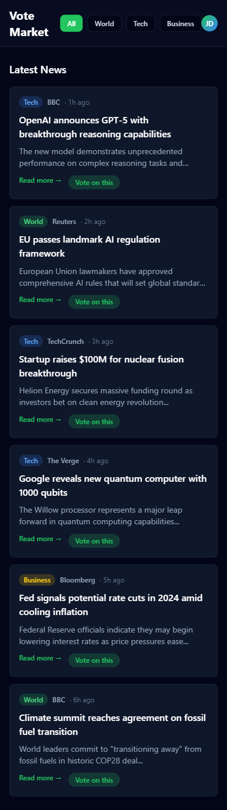

# Vote Market — UI Mock-ups

> Generated via Puppeteer. Re-run `npm run mockups` after HTML changes.

## Design System

**Colors:**
- Background: `#020617` (slate-950)
- Surface: `#0f172a` (slate-900)
- Border: `#1e293b` (slate-800)
- Primary: `#22c55e` (green-500)
- Danger: `#ef4444` (red-500)

**Typography:**
- Headings: Bold, white
- Body: Regular, slate-300
- Meta info: Small, slate-400/slate-500

**Components:**
- Cards: Surface background with border, rounded-xl
- Buttons: Primary green for actions, surface for secondary
- Category pills: Colored backgrounds with matching text
- Vote bar: Horizontal progress bar showing up/down ratio

---

## Log In

### Desktop (1280×800)

### Mobile (390×844)

**Notes:**
- Centered form layout
- Email/password fields with focus states
- Google OAuth button with brand colors
- Error state shown (hidden by default)
- Link to sign up page

---

## Sign Up

### Desktop (1280×800)

### Mobile (390×844)

**Notes:**
- Similar to login with additional name field (optional)
- Password confirmation field
- Google OAuth option
- Link to log in page

---

## Feed (All Categories)

### Desktop (1280×900)

**Notes:**
- Split layout: topic grid (left) + news sidebar (right)
- Category filter chips in header (All, World, Tech, Business)
- Topic cards show: category pill, time ago, title, vote bar, vote buttons
- Vote buttons show active state when user has voted
- News sidebar shows: source badge, headline, time, "Vote on this" button
- User menu with avatar and logout in header

---

## Feed (Tech Category Filtered)

### Desktop (1280×900)

**Notes:**
- Same layout as feed but filtered to Tech category
- Tech category chip highlighted (green background)
- Only tech topics and news displayed
- Category inherited from RSS feed

---

## Topic Detail + Comments

### Desktop (1280×900)

### Mobile (390×844)

**Notes:**
- Back link to feed
- Topic header with category, time, title, description
- Source attribution (e.g., "Source: BBC Technology")
- Large vote bar with percentage and vote counts
- Prominent vote buttons (up/down)
- Comments section with count
- Comment form at top of comments
- Flat comment list (no threading in v1)
- Each comment shows: avatar, name, time, body
- Mobile layout stacks vertically, same components

---

## News (Mobile Layout)

### Mobile (390×844)

**Notes:**
- Full-width news list for mobile
- Category filter chips in header
- News cards show: category pill, source, time, headline, summary
- "Read more" link to external article
- "Vote on this" button to promote to topic
- Used when sidebar is hidden on small screens

---

## Next Steps

1. Review mockups and iterate on HTML/CSS as needed
2. Re-run `npm run mockups` after any changes
3. Proceed to Phase 1: Scaffold Next.js project
4. Use these mockups as visual reference for real implementation
